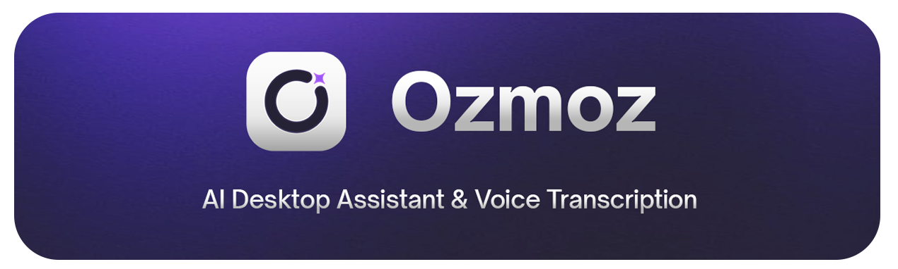
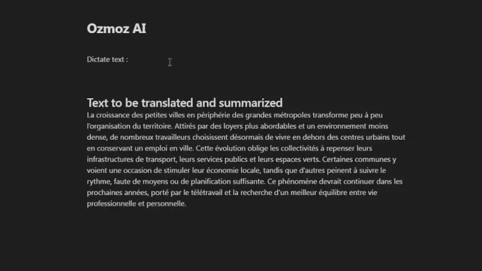

<div align="center">
  

<p>
  <br><br>
<p>
  <a href="https://www.python.org/">
    
  </a>
  <a href="https://github.com/zerep-thomas/ozmoz/releases">
    
  </a>
  <a href="https://pywebview.flowrl.com/">
    
  </a>
  <a href="https://creativecommons.org/licenses/by-nc-sa/4.0/">
    
  </a>
  <a href="docs/docs.md">
    
  </a>
  <a href="https://www.instagram.com/ozmoz.ai/" target="_blank">
    
  </a>
</p>

<br>
<br>

<a href="https://github.com/zerep-thomas/ozmoz/releases/latest">
  
</a>

</div>

<br>

## 📖 Overview

**Ozmoz** is a desktop application that integrates AI into the Windows operating system. Unlike web-based chat interfaces, Ozmoz floats above your applications, allowing you to interact with AI models (Groq, Cerebras) and high-speed transcription engines (Groq, Deepgram) without interrupting your workflow.
<br>

<div align="center">
  
</div>

## ✨ Key Features

- **🎙️ Ultra-low latency transcription:** uses Groq/Whisper and Deepgram Nova-2/3 for near-instant speech-to-text transcription directly in any application.
- **🧠 Contextual AI:** select text in any application, press a keyboard shortcut, and Ozmoz analyzes it using the latest LLMs.
- **👁️ Screen vision:** allows AI to “see” your active window to explain code, analyze data, or summarize (multimodal).
- **🌐 Live Web Search:** performs real-time internet searches to provide up-to-date answers with citations, bridging the gap between LLMs and live data.
- **🤖 Custom agents:** create specialized characters triggered by voice keywords (e.g., “Hey Dev” to switch to a coding assistant).
- **⚡ Smart replacements:** built-in text expander for frequently used phrases.
- **📊 Analytics dashboard:** tracks dictated words, time saved, and typing speed (WPM).

<br>

## 🛠️ Tech Stack

A hybrid architecture chosen for high performance and low memory footprint (vs. Electron).

- **Core:** Python 3.10+ (AI Orchestration & Backend Logic).
- **GUI Bridge:** `pywebview` (Wraps native Edge WebView2 for lightweight rendering).
- **Frontend:** HTML5, CSS3, Modern JavaScript (ES6 Modules, no framework overhead), Chart.js.
- **OS Integration:** `pywin32` & `ctypes` (Low-level System Hooks), `mss` (Ultra-fast Screen Capture), `keyboard` (Global Hotkeys).
- **Audio Processing:** `PyAudio` (Stream I/O), `numpy` (Real-time FFT & Signal Processing).

<br>

## 🚀 Installation

### Prerequisites

Before running Ozmoz, ensure you have the following installed:

- **Windows 10/11** (Required for low-level hooks).
- **Python 3.10** or higher.

### Setup Guide

1.  **Clone the repository**

    ```bash
    git clone https://github.com/ton-profil/ozmoz.git
    cd ozmoz
    ```

2.  **Create a Virtual Environment** (Recommended)

    ```bash
    python -m venv venv
    .\venv\Scripts\activate
    ```

3.  **Install Dependencies**

    ```bash
    pip install -r requirements.txt
    ```

4.  **Run the Application**
    ```bash
    python app.py
    ```

<br>

## ⚙️ Configuration

Ozmoz is designed to be model-agnostic but requires API keys for cloud inference.
Upon first launch, click the **Gear Icon ⚙️** in the UI and navigate to the **API Keys** tab.

| Provider         | Purpose                                            | Requirement            |
| :--------------- | :------------------------------------------------- | :--------------------- |
| **Groq API**     | Ultra-fast text inference & Whisper transcription. | **Required**           |
| **Deepgram API** | _Nova-2_ model for lightning-fast voice-to-text.   | Optional (Recommended) |
| **Cerebras API** | High-throughput alternative for LLM tasks.         | Optional               |

> **Note:** API keys are stored securely in your local OS credential manager (Windows Credential Locker) using the `keyring` library. They are never synced to the cloud.

<br>

## ⌨️ Controls & Hotkeys

Ozmoz sits quietly in the background. Use these global shortcuts to control it from any application.

| Action                   | Default Hotkey                   | Description                                                                            |
| :----------------------- | :------------------------------- | :------------------------------------------------------------------------------------- |
| **Start/Stop Dictation** | <kbd>Ctrl</kbd> + <kbd>X</kbd>   | Toggles the microphone. Transcription is automatically pasted at the cursor.           |
| **Ask AI**               | <kbd>Ctrl</kbd> + <kbd>Q</kbd>   | Analyze selected text or answer a voice command using the active LLM.                  |
| **Screen Vision**        | <kbd>Alt</kbd> + <kbd>X</kbd>    | Takes a screenshot of the active window and sends it to the Vision model for analysis. |
| **Web Search**           | <kbd>Alt</kbd> + <kbd>W</kbd>    | Performs a live web search based on your voice prompt or selection.                    |
| **Toggle UI**            | <kbd>Ctrl</kbd> + <kbd>Alt</kbd> | Hides or Shows the floating widget overlay.                                            |

<br>

## 🏗️ Building from Source

To create a standalone `.exe` file for distribution without Python installed:

1.  Ensure `pyinstaller` is installed:

    ```bash
    pip install pyinstaller
    ```

2.  Build using the included spec file (handles assets & dependencies):

    ```bash
    pyinstaller Ozmoz.spec
    ```

3.  The executable will be generated in the `dist/Ozmoz/` folder.

<br>

## 🤝 Contributing

Contributions are what make the open-source community such an amazing place to learn, inspire, and create. Any contributions you make are **greatly appreciated**.

1.  Fork the Project
2.  Create your Feature Branch (`git checkout -b feature/AmazingFeature`)
3.  Commit your Changes (`git commit -m 'Add some AmazingFeature'`)
4.  Push to the Branch (`git push origin feature/AmazingFeature`)
5.  Open a Pull Request

<br>

## 📄 License

Distributed under CC BY-NC-SA 4.0 License. See `LICENSE` for more information.
This software includes the following open-source software:

- **Chart.js** (MIT License) - Copyright (c) 2014-2022 Chart.js Contributors
- **chartjs-plugin-datalabels** (MIT License) - Copyright (c) 2017-2021 chartjs-plugin-datalabels contributors
- **KaTeX** (MIT License) - Copyright (c) 2013-2024 Khan Academy and other contributors
- **Highlight.js** (BSD 3-Clause) - Copyright (c) 2006, Ivan Sagalaev
- **PyWebView** (BSD 3-Clause) - Copyright (c) 2014-2024 Roman Sirokov

<br/>

<div align="center">
  <p>
    Built with ❤️
  </p>
  <p>
    &copy; 2025 Ozmoz 
  </p>
</div>
