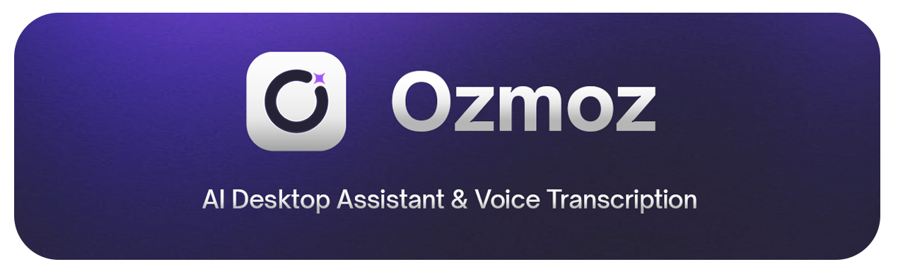
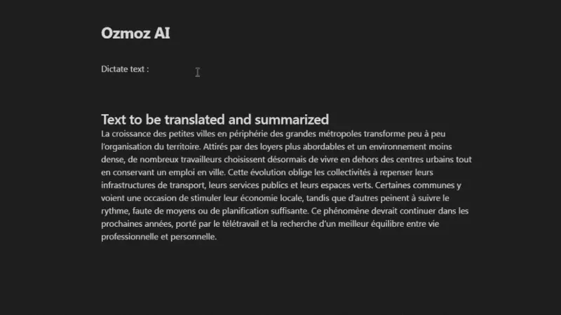

  
    
  
  
  
  
  

  

  
  

 

## Overview

**Ozmoz** is a desktop integration tool designed to bridge the gap between Windows applications and Large Language Models (LLMs). It operates as a persistent overlay, enabling seamless access to speech-to-text engines and AI analysis without context switching.

The application supports a **hybrid architecture**, allowing users to choose between local privacy-focused processing (Whisper V3 Turbo) and high-performance cloud APIs (Groq, Deepgram).

  

## Key Features

- **Global Dictation:** System-wide voice transcription using local CUDA acceleration or low-latency cloud APIs.
- **Contextual Intelligence:** Analyze selected text in any application via global hotkeys.
- **Multimodal Vision:** Screen capture capabilities for AI-assisted troubleshooting, code explanation, and data extraction.
- **Web Search:** Real-time information retrieval with citation support.
- **Privacy & Security:** API keys and chat history are encrypted at rest. Full offline capability available.

## Technical Architecture

Ozmoz is engineered for minimal resource footprint while maintaining high performance:

- **Backend:** Python 3.10+ handling orchestration and logic.
- **Inference:** `faster-whisper` (CTranslate2) for local speech recognition.
- **Interface:** `pywebview` (Edge WebView2) for a responsive, modern GUI.
- **System Integration:** Low-level hooks via `pywin32` and `ctypes` for window management and input simulation.

## Installation

1.  Download the latest installer from the [Releases Page](https://github.com/zerep-thomas/ozmoz/releases).
2.  Run `Ozmoz-Setup.exe`.
3.  Follow the [Configuration Guide](docs/configuration.md) to set up your AI providers.

## License

This project is distributed under the **CC BY-NC-SA 4.0** License.
Bundled dependencies (FFmpeg, zlibwapi) are subject to their respective licenses.

   
  
&copy; 2026 Ozmoz Project

