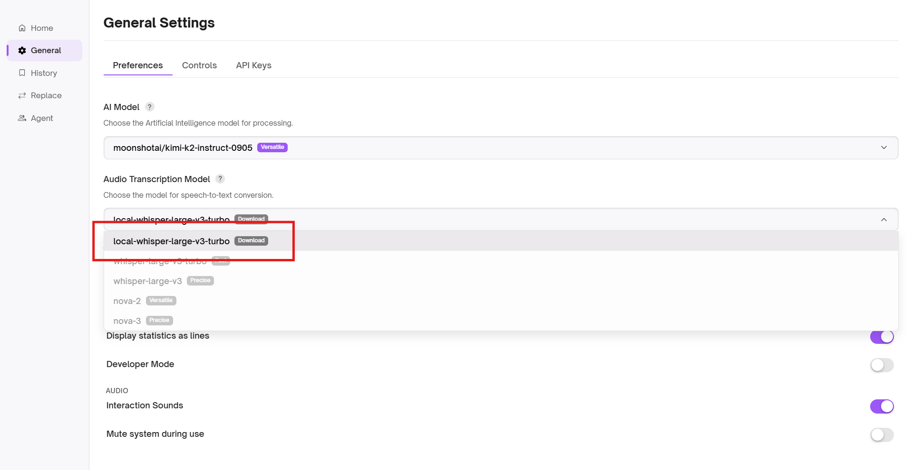
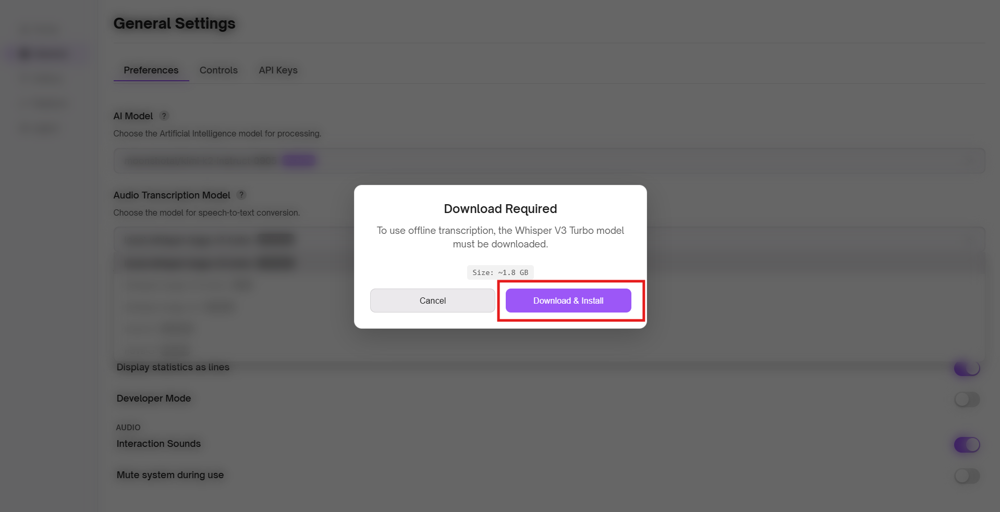
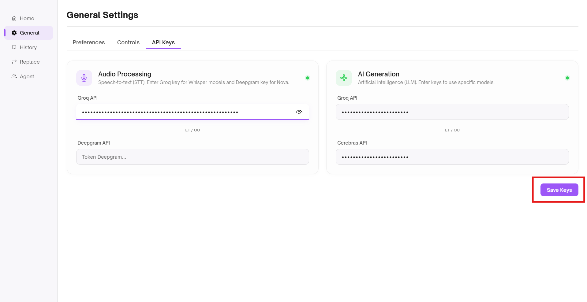
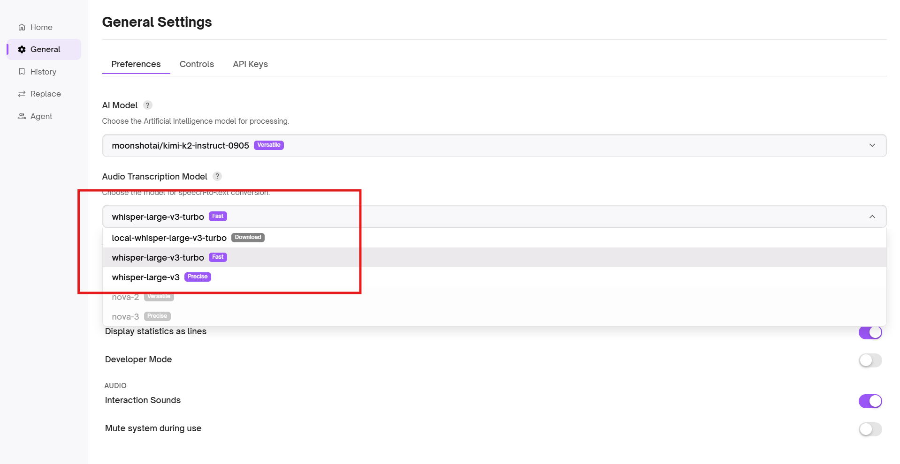

# ⚙️ Configuration Guide

Ozmoz is a **hybrid** application. You can choose between maximum privacy with local models or maximum speed and intelligence with Cloud APIs.

---

## 🏗️ Choose your Engine

| Feature     | 🏠 Local Model (Whisper) | ☁️ Cloud APIs (Groq/Deepgram)           |
| :---------- | :----------------------- | :-------------------------------------- |
| **Privacy** | 100% Offline             | Data processed by provider              |
| **Speed**   | Depends on your GPU/CPU  | Ultra-fast (Sub-second)                 |
| **Cost**    | Completely Free          | Free tier available (API keys required) |
| **Setup**   | 1.8 GB Download          | Simple API Key copy-paste               |

---

## 🏠 Option 1: Local Model (Offline)

Ideal for users who prioritize privacy and don't want their voice data to leave their computer.

### 1. Select the Model

Open the **General Settings** and select **Whisper V3 Turbo** from the model dropdown menu.

  

### 2. Initial Download

Click the **Download** button. A progress bar will appear.

> [!IMPORTANT]
> The model is approximately **1.8 GB**. Ensure you have a stable connection. Once downloaded, Ozmoz will never need the internet again for transcription.

  

---

## ☁️ Option 2: Cloud APIs (High Performance)

Ideal for ultra-low latency transcription and advanced LLM features (Screen Vision, Web Search).

### 1. Obtain your API Keys

You can get free API keys from the following providers:

- 🔑 **[Groq Cloud](https://groq.com/)** (Fastest LLM & Transcription)
- 🔑 **[Cerebras AI](https://cerebras.ai/)** (High-speed inference)
- 🔑 **[Deepgram](https://deepgram.com/)** (Alternative high-quality transcription)

### 2. Secure Entry

Go to **Settings > API Keys** and paste your keys into the respective fields.

> [!TIP] > **Security Note:** Ozmoz automatically masks your keys (`********`) and stores them securely in your local environment.

  

---

## 🚀 Ready to go!

Once configured, you can switch between models at any time using the main interface. You are now ready to use Ozmoz!

  
    
  
  [**View Hotkeys & Controls →**](features/shortcuts.md)

