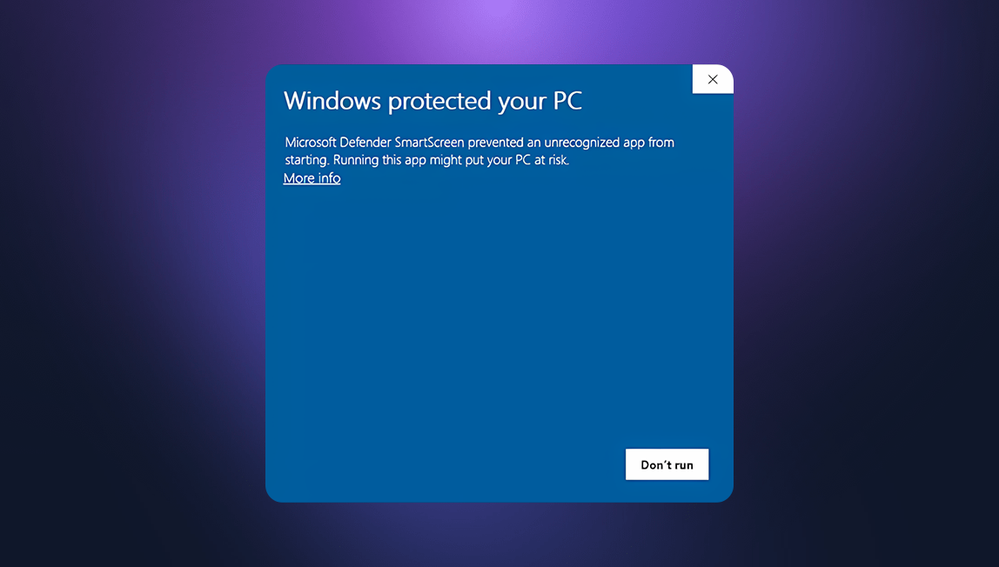
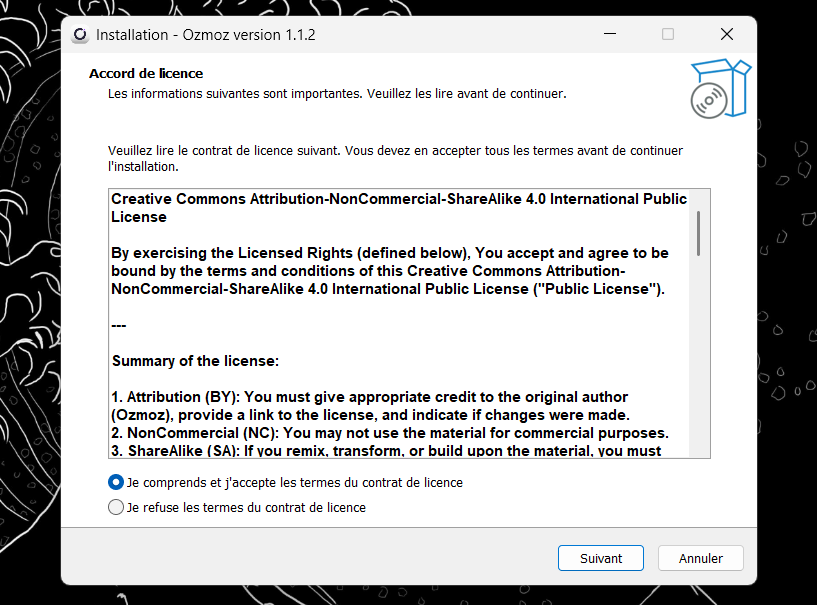

# 📥 Installation Guide

Follow these simple steps to get Ozmoz running on your Windows machine.

---

### 1. Download the Executable

Navigate to the [Official Releases Page](https://github.com/zerep-thomas/ozmoz/releases) and download the latest version of `Ozmoz-Setup.exe`.

> [!TIP]
> Always download Ozmoz from the official repository to ensure you have the most secure and up-to-date version.

 

### 2. Bypass Windows SmartScreen

Because Ozmoz is a new, community-driven project, it is not yet digitally signed with a costly Microsoft certificate. Windows might show a blue **"Windows protected your PC"** alert.

**To proceed:**

1. Click on **"More Info"**.
2. Click the **"Run anyway"** button that appears.

  
  
<i>Don't worry, Ozmoz is safe and open-source.</i>

 

### 3. Standard Setup

Once the installer launches, follow the on-screen instructions. You can choose the default installation path or select a custom directory.

  

_The installer will automatically create a desktop shortcut for quick access._

 

### 4. Finalizing

After the installation is complete, Ozmoz will launch. You will then need to configure your AI providers.

---

### ⏭️ What's next?

Now that Ozmoz is installed, let's set up your API keys and local models.

[**Go to Configuration Guide →**](configuration.md)

